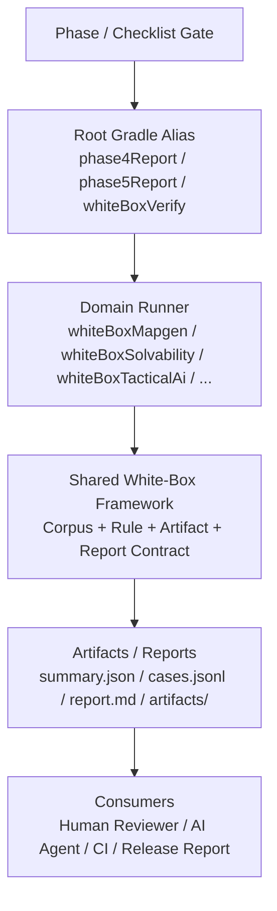

# 统一白盒验证框架（Unified White-Box Verification Framework）

> 日期：2026-04-04  
> 状态：Execution baseline after `Phase 4 PR-03` on `main`  
> 适用范围：`Phase 4`、`Phase 5` 以及后续所有新增 harness / lab / QA domain  
> 文档定位：项目级验证基础设施设计权威；负责统一白盒验证框架架构、报告合同、AI 消费合同、人工一致性策略与扩展规范  
> 量化门槛权威：仍以 phase checklist 为准；本文件负责解释框架如何支撑这些门槛，而不替代 phase checklist

---

## 1. 直接结论

K-ToME 不能继续把“白盒验证”维持在“人工跑几局、目视确认差异”的口径上。

原因不是人工不重要，而是当前项目已经进入 `Phase 4 / Phase 5`：

1. 验证对象从单一地图或单一战斗，扩展到 `mapgen / solvability / loot / hidden content / tactical AI / replay / perf / soak / localization / accessibility / content pack`。
2. 这些系统都要求：
   - 固定 corpus
   - 确定性回放
   - 结构化报告
   - 可被 AI agent 直接读取
   - 可被 phase gate 聚合
3. 如果继续把“白盒”理解为一套零散的人工步骤，最终会出现三套彼此脱节的验证路径：
   - 自动化 harness
   - 手工白盒
   - AI 审查辅助

本文件的结论是：

1. K-ToME 需要一套统一白盒验证框架。
2. 这套框架不是替代现有 harness，而是把现有 `Runner + @Tag Test + Gradle task + HarnessReportHeader` 体系提升为项目级共享合同。
3. “共享”的核心不是某个 mapgen renderer，而是统一的：
   - corpus
   - case / aggregate 报告模型
   - artifact 组织
   - join key
   - version stamp
   - AI 读取协议
   - 与人工白盒的一致性校准方式

---

## 2. 文档定位与权威关系

本文件与现有文档的关系如下：

1. [2026-03-13-phase2-to-phase5-final-roadmap.md](./2026-03-13-phase2-to-phase5-final-roadmap.md)
   - 继续是阶段划分、工作包、门禁与出口条件的执行权威。
2. [2026-03-13-core-systems-design-and-phase-supplements.md](./2026-03-13-core-systems-design-and-phase-supplements.md)
   - 继续是系统内部合同、公式与核心数据结构的设计权威。
3. [phase4/2026-03-13-phase4-verification-checklist.md](./phase4/2026-03-13-phase4-verification-checklist.md)
   - 继续是 `Phase 4` 的量化门槛与 batch 覆盖权威。
4. [phase5/2026-03-13-phase5-regression-checklist.md](./phase5/2026-03-13-phase5-regression-checklist.md)
   - 继续是 `Phase 5` 的量化门槛与 release regression 权威。
5. 本文件负责统一：
   - 白盒验证框架架构
   - 报告与 artifact 合同
   - AI agent 使用协议
   - 人工一致性与校准策略
   - 扩展新领域时的统一方法

覆盖原则：

1. phase checklist 决定“多少 seed / 多少场景 / 多少阈值才算通过”。
2. 本文件决定“这些 seed / 场景应该如何组织、输出、被 AI 消费与与人工对齐”。
3. 单个 PR 文档不得再各自维护第二套长期白盒框架设计，只保留本 PR 的最小验收摘要。

---

## 3. 设计目标与非目标

### 3.1 目标

统一白盒验证框架必须满足以下目标：

1. **可重放**
   - 所有白盒 case 都必须绑定固定 corpus，而不是临时人工挑选。
2. **可追溯**
   - 所有 case 都必须有稳定 join key，可把 summary、per-case 报告、artifact、失败定位串起来。
3. **可被 AI 读取**
   - 输出必须优先是结构化 JSON/JSONL，其次才是供人类快速阅读的 Markdown 或文本。
4. **可纳入 phase gate**
   - 必须能接入现有 root Gradle alias，不成为独立于 phase gate 之外的平行体系。
5. **可扩展**
   - 必须同时适用于差异性域与固定场景域，而不是只服务 `mapgen`。
6. **不制造第二套真源**
   - 规则真源仍在 `core / game / client`；白盒框架只做验证、渲染、聚合和报告。

### 3.2 非目标

统一白盒验证框架不是下面这些东西：

1. 不是对“游戏是否真的好玩”的最终判官。
2. 不是 package 启动、输入手感、UI 可读性、Accessibility 真实可用性的完全替代品。
3. 不是新的规则运行时。
4. 不是要求所有现有 harness 立刻重写成同一份实现模板。
5. 不是把所有验证都降级成纯文本 grep。

---

## 4. 当前项目基线与问题

### 4.1 已存在且可直接复用的资产

截至 `2026-04-04`，仓库内已经具备以下可复用资产：

1. `HarnessReportHeader`
   - 位置：`core/src/main/kotlin/com/ktome/core/harness/HarnessReportHeader.kt`
2. `MapgenSmokeRunner`
   - 位置：`tools/src/main/kotlin/com/ktome/tools/mapgen/MapgenSmokeRunner.kt`
3. `SolvabilityHarnessRunner`
   - 位置：`tools/src/main/kotlin/com/ktome/tools/mapgen/SolvabilityHarnessRunner.kt`
4. `HarnessReportWriter`
   - 位置：`game/src/main/kotlin/com/ktome/game/harness/ScenarioUtil.kt`
5. root alias
   - `./gradlew mapgenSmoke`
   - `./gradlew solvabilityHarness`

本次设计期间已确认以下事实：

1. `./gradlew mapgenSmoke` 可以成功生成：
   - `tools/build/reports/phase4/mapgen/mapgen-smoke-summary.json`
   - `tools/build/reports/phase4/mapgen/mapgen-smoke-seeds.jsonl`
2. `./gradlew solvabilityHarness` 可以成功生成：
   - `tools/build/reports/phase4/solvability/solvability-summary.json`
   - `tools/build/reports/phase4/solvability/solvability-proofs.jsonl`

### 4.2 当前主干所处阶段

截至当前 `main`，`Phase 4 PR-03` 已完成，意味着：

1. `PR-01`
   - `MapgenPipeline`
   - `GeneratedFloor`
   - `TerrainTag`
   - `mapgenSmoke`
   已经成立
2. `PR-02`
   - hybrid topology
   - pattern room
   - vault
   - biome family
   已经进入正式主线
3. `PR-03`
   - `SolvabilityGraph`
   - hidden entrance
   - `SearchAction` 相关 proof / harness 路径
   - `solvabilityHarness`
   已经进入正式主线

因此，本文件不再把 `whiteBoxMapgen / whiteBoxSolvability` 视为遥远的未来方向，而是把它们定义为：

1. `PR-03` 之后已在主干落地的第一阶段 Tools/QA white-box pilot
2. `Phase 4` 后续开发应共同遵守的验证框架要求
3. 后续 `loot / hidden content / content pack` 与 `Phase 5` 固定场景域接入时必须复用的统一白盒标准

### 4.3 当前不足

虽然已有 harness 体系已经成立，但仍存在以下结构性问题：

1. **共享层仍过薄**
   - 目前是“每个 runner 各自写 JSON”，还没有项目级统一 white-box contract。
2. **命名和模型仍偏 phase / domain 专属**
   - `HarnessReportHeader` 当前字段主要面向 `Phase 4`，不够表达 `Phase 5` 的 replay / AI / perf 版本信息。
3. **AI 消费协议缺失**
   - 当前报告是结构化的，但没有定义 AI 的统一读取顺序和 triage 方式。
4. **人工白盒口径分裂**
   - `PR-02` 使用 `5 seed / >=3 类差异`
   - `Phase 4 checklist` 仍写 `3 seed 人工观察`
5. **执行入口容易误用**
   - 根 `test` 默认会排除 `mapgenSmoke`、`solvabilityHarness` 等 tag，因此白盒任务不能依赖 `:tools:test --tests` 这种普通测试路径。

---

## 5. 顶层架构

统一白盒验证框架采用五层结构：



### 5.1 各层职责

#### Phase / Checklist Gate

职责：

1. 定义量化通过标准。
2. 决定哪些 domain 属于正式门禁。

不负责：

1. 定义 artifact 格式。
2. 定义 AI 消费协议。

#### Root Gradle Alias

职责：

1. 提供正式执行入口。
2. 聚合多个 domain runner。
3. 作为 CI / 本地统一命令边界。

正式约束：

1. `whiteBoxVerify` 只是开发便利入口，不是 release gate 唯一入口。
2. 当前主干已落地 `whiteBoxMapgen / whiteBoxSolvability / whiteBoxVerify / phase4Report`。
3. 当前 `phase4Report` 已聚合 `mapgenSmoke / solvabilityHarness / bossHarness / whiteBoxMapgen / whiteBoxSolvability`，后续再继续吸收其余 `Phase 4` domain。
4. `Phase 5` 应建立 `phase5Report` 或等价聚合入口。

#### Domain Runner

职责：

1. 定义某个领域的 corpus。
2. 调用正式规则真源。
3. 生成该领域可读 artifact。
4. 运行 case rule 与 aggregate rule。
5. 输出统一格式报告。

原则：

1. 一个领域一个 runner。
2. 共享框架不接管领域知识。

#### Shared White-Box Framework

职责：

1. 定义共享 case / aggregate / artifact / report 合同。
2. 提供 corpus 执行模板、报告写入、artifact retention、join key 规则。
3. 向 AI 与人类 reviewer 提供稳定读取面。

#### Artifacts / Reports

职责：

1. 以结构化报告和人类可读 artifact 记录证据。
2. 为 AI triage、文档归档、回归比对提供统一载体。

### 5.2 模块归属

模块边界固定如下：

1. `core`
   - 只放稳定 DTO / typed contract / version stamp
   - 不放文件 I/O、Markdown writer、domain renderer
2. `tools`
   - 放 shared white-box framework 的执行层
   - 放 domain runner、artifact writer、聚合逻辑
3. `game / client`
   - 继续提供领域数据和现有 harness 资产
   - 不复制第二套规则或状态真源

---

## 6. 核心抽象与合同

共享层不再直接接 `GeneratedFloor` 这类 mapgen 词汇，而是使用项目级泛化合同。

建议的正式抽象如下：

```kotlin
@Serializable
data class ContractVersionStamp(
    val contractId: String,
    val version: String,
)

@Serializable
data class VerificationReportHeader(
    val harnessId: String,
    val phaseId: String,
    val buildId: String,
    val locale: String,
    val corpusId: String,
    val timestamp: String,
    val activePackIds: List<String>,
    val activePackManifestVersions: Map<String, String>,
    val contractVersions: List<ContractVersionStamp>,
    val seedList: List<Long> = emptyList(),
)

@Serializable
data class WhiteBoxJoinKey(
    val seed: Long? = null,
    val zoneId: String? = null,
    val floorIndex: Int? = null,
    val scenarioId: String? = null,
)

@Serializable
data class WhiteBoxAssertionResult(
    val ruleId: String,
    val passed: Boolean,
    val severity: String,
    val message: String,
    val context: JsonObject = JsonObject(emptyMap()),
)

@Serializable
data class WhiteBoxArtifact(
    val artifactId: String,
    val kind: String,
    val format: String,
    val relativePath: String,
    val summary: String? = null,
    val tags: List<String> = emptyList(),
)

@Serializable
data class WhiteBoxCaseReport(
    val joinKey: WhiteBoxJoinKey,
    val facts: JsonObject,
    val fingerprints: Map<String, String>,
    val assertions: List<WhiteBoxAssertionResult>,
    val artifacts: List<WhiteBoxArtifact>,
)

@Serializable
data class WhiteBoxAggregateReport(
    val groupId: String,
    val sampleCount: Int,
    val metrics: JsonObject,
    val assertions: List<WhiteBoxAssertionResult>,
)

data class WhiteBoxCorpusSpec(
    val corpusId: String,
    val description: String,
    val sampleCount: Int,
)

enum class ArtifactRetentionPolicy {
    ALL,
    FAILURES_PLUS_SAMPLES,
    SUMMARY_ONLY,
}

fun interface WhiteBoxCaseRule<T> {
    fun verify(case: T): List<WhiteBoxAssertionResult>
}

fun interface WhiteBoxAggregateRule<T> {
    fun verify(cases: List<T>): List<WhiteBoxAssertionResult>
}
```

### 6.1 关键决策

1. `Map<String, Any>` 不进入正式共享 Kotlin 合同。
   - 原因：难以版本化、难以序列化、难以被 AI 稳定消费。
   - 正式替代：typed DTO 或 `JsonObject`
2. `VariabilityAnalyzer` 不是共享框架核心命名。
   - 共享层统一称为 aggregate analysis
   - “variability”只属于差异性域的一个具体 metric
3. 共享层不持有领域大对象。
   - 例如 `GeneratedFloor`、`ReplayRun`、`AIDecisionTraceBatch` 都属于领域 runner 内部输入
4. 共享层只要求：
   - case 事实
   - aggregate 事实
   - assertion
   - artifact
   - join key

### 6.2 `HarnessReportHeader` 的演进策略

当前代码中的 `HarnessReportHeader` 已经是有效资产，不应推翻。

建议演进方式：

1. `Phase 4` 现有 runner 继续使用 `HarnessReportHeader`。
2. 新 white-box framework 通过 adapter 把 `HarnessReportHeader` 映射到 `VerificationReportHeader`。
3. 等 `Phase 5` 域接入时，再统一收口为更通用的 header 表达。

这样可以避免为了“框架统一”而强行重写现有 `mapgenSmoke` / `solvabilityHarness`。

---

## 7. 报告与产物合同

所有 white-box domain 的标准输出固定为四件套：

```text
tools/build/reports/<phase>/whitebox/<domain>/
├── whitebox-<domain>-summary.json
├── whitebox-<domain>-cases.jsonl
├── whitebox-<domain>-report.md
└── artifacts/
```

说明：

1. `summary.json`
   - 供 gate、CI、AI 首次读取
   - 顶层必须保留 AI fast-path 字段：`verdict / failedCaseCount / failedAggregateCount / firstFailedJoinKey`
2. `cases.jsonl`
   - 一行一个 case，供 join key 精确定位
3. `report.md`
   - 面向人类 reviewer 的摘要报告
4. `artifacts/`
   - 放结构化可视化、trace、表格、采样摘要等证据文件

### 7.1 `annotated-maps.txt` 的定位

`annotated-maps.txt` 这类纯文本报告仍然有价值，但它属于领域附加 artifact，不是全局主合同。

原因：

1. 不是每个领域都能自然映射成单一文本文件。
2. AI 应该优先读结构化数据，再读方便审阅的文本 artifact。

### 7.2 join key 纪律

所有 case 必须具备稳定 join key。

规则：

1. 地图 / floor 相关域：优先使用 `seed + zoneId + floorIndex`
2. 固定场景域：优先使用 `scenarioId`
3. run / replay 域：允许扩展 `runId` 或 `corpusEntryId`，但仍应落入 `WhiteBoxJoinKey` 兼容结构

### 7.3 artifact 命名纪律

artifact 必须满足：

1. 命名稳定
2. 可通过 `artifactId` 唯一引用
3. 相对路径始终相对 domain report root
4. `summary.json` 或 `cases.jsonl` 中必须能反查到 artifact

---

## 8. 域分类与扩展模式

统一白盒框架把 domain 分成两类。

### 8.1 差异性域

目标：证明“同一系统在多个 seed 下存在可感知差异，但不破坏核心合同”。

适用领域：

1. `mapgen`
2. `hidden content`
3. `loot ecology`
4. `content pack`

默认规则：

1. 使用固定 `5 seed` corpus
2. 输出 aggregate 差异指标
3. 至少证明多维差异，而不是只证明“随机了”

### 8.2 固定场景域

目标：证明“在固定场景下，系统行为稳定、可解释、可回归”。

适用领域：

1. `boss`
2. `tactical AI`
3. `replay`
4. `death analysis`
5. `perf`
6. `soak`
7. `localization`
8. `accessibility`

默认规则：

1. 使用固定 scenario corpus
2. 不强行套用 `5 seed / >=3 类差异`
3. 重点看：
   - 决策
   - trace
   - hash
   - percentile
   - drift
   - violation list

### 8.3 新增领域接入三步法

任何新 domain 接入统一框架时，至少做三步：

1. **定义 corpus**
   - 是 `5 seed` 差异性域，还是固定场景域
2. **定义 rule**
   - case rule
   - aggregate rule
3. **定义 artifact renderer**
   - 这个领域输出什么证据，AI 和人类如何读

推荐补充第四步：

4. **定义正式 Gradle alias 和 phase gate 接线**

---

## 9. 领域 artifact 设计原则

共享框架不强迫所有领域都长得一样，但每个领域都必须输出“玩家可感知语义”的证据，而不是只输出内部对象 dump。

### 9.1 Mapgen

必须输出：

1. base map
2. room / topology 标注
3. semantic overlay
   - vault
   - pattern
   - entrance
   - terrain
4. legend 与 structural table

要求：

1. 不允许只有单层覆盖结果
2. 必须保留多 pane 语义，避免 `V / P / ~` 相互覆盖后丢证据

### 9.2 Solvability

必须输出：

1. topology overview
2. proof path
3. search state table
4. secret proof / resolved entrance binding table

要求：

1. 必须把 `visitedNodes / acquiredKeys / unresolvedRequirements` 变成可读 artifact，而不是只留在 JSON 字段里
2. 必须同时展示 reveal success / reveal fail / backtrack proof 这类玩家可感知语义
3. backtrack proof 属于 corpus coverage 要求，不应被误建模为每个 sampled case 的硬门槛

### 9.3 Tactical AI

必须输出：

1. 候选动作
2. 最终动作
3. selection reason
4. target 变化
5. telegraph 响应
6. 关键 trace hash

不允许只输出：

1. `aiTraceHash`
2. “通过/失败”

### 9.3 Replay / Death Analysis

必须输出：

1. semantic hash
2. trace hash
3. event / turn 计数
4. death analysis 摘要
5. 关键 last-N-turn 证据

### 9.4 Perf / Soak

必须输出：

1. percentile 表
2. spike 列表
3. drift 摘要
4. outlier case

不允许只输出：

1. “性能通过”
2. “无 OOM”

---

## 10. AI 使用设计

AI agent 的读取协议必须明确，不允许把“AI 可读”退化成“让模型自己去 grep 一堆日志”。

### 10.1 AI 入口顺序

AI 的标准读取顺序固定为：

1. 读 `summary.json`
2. 找失败 aggregate 或失败 case
3. 取 join key
4. 去 `cases.jsonl` 读取对应 case
5. 根据 case 中的 artifact 列表读取 `artifacts/`
6. 对照 assertion/context/version stamp 形成结论

### 10.2 AI triage 流程

标准 triage 流程如下：

1. 找失败 case
2. 取 `joinKey`
3. 读取该 case 的 `facts`
4. 读取该 case 的 `assertions`
5. 读取该 case 的 `artifacts`
6. 对照 `contractVersions`
7. 输出：
   - 失败位置
   - 失败原因
   - 对应证据
   - 可能修复方向

### 10.3 AI 使用纪律

AI 必须遵守：

1. 优先使用结构化字段
2. 不优先依赖裸文本 grep 判断结论
3. 引用 artifact 时必须通过 `artifactId` 或 join key 定位
4. 做跨报告对照时必须通过 join key 或稳定 fingerprint，而不是靠文件名猜测

### 10.4 AI 可读性要求

为了让 AI 真正可用，artifact 必须满足：

1. 命名稳定
2. 路径稳定
3. `summary -> case -> artifact` 可反查
4. 失败必须有：
   - `ruleId`
   - `message`
   - `context`
   - `version stamp`

---

## 11. 与人工游玩体验一致性的设计

统一白盒验证框架的目标不是“替代人工游玩”，而是把自动化白盒与人工体验做三层对齐。

### 11.1 规则一致性

规则一致性要求：

1. 自动白盒必须消费正式规则真源。
2. 不允许从 UI 文本、截图文案、客户端临时状态反推规则结论。

换句话说：

1. `mapgen` 消费 `GeneratedFloor` / `TopologyGraph`
2. `tactical AI` 消费正式 `AIDecisionTrace` / `TacticalAIDecisionTrace`
3. `replay` 消费正式 replay schema

这层保证的是“自动白盒验证的对象与真实游戏规则一致”。

### 11.2 感知一致性

感知一致性要求 artifact 尽量映射到玩家真正能感知到的语义面。

要求：

1. 对 `mapgen`
   - 输出人和 AI 都读得懂的标注图，而不是只给内部对象 dump
2. 对 `tactical AI`
   - 输出“行动理由 / 目标切换 / telegraph 响应”，而不是只给 hash
3. 对 `perf / soak`
   - 输出 percentile / spike / drift，而不是只给通过结论

这层保证的是“自动白盒输出的证据能映射回玩家体验”。

### 11.3 校准一致性

自动白盒与人工游玩之间仍可能出现偏差，因此必须保留人工抽样校准。

校准机制：

1. 每个关键域保留少量人工抽样白盒
2. 定期检查：
   - 自动通过但人工觉得不对的 false negative
   - 自动失败但实际体验可接受的 false positive
3. 若某类偏差长期存在，优先：
   - 调整 artifact 设计
   - 调整 aggregate 指标
   - 调整规则映射

而不是简单堆更多阈值

### 11.4 仍必须保留的人工环节

统一框架落地后，以下人工环节仍必须保留：

1. package 启动与最小游玩
2. UI 可读性与输入体验
3. Boss 战体感、节奏与 telegraph 可感知性
4. Accessibility 真实可用性

结论：

1. 白盒框架保证的是“规则与感知证据可追溯”
2. 它不保证“游戏一定好玩”

---

## 12. 与现有项目的结合方式

### 12.1 直接复用

优先直接复用以下现有资产：

1. `HarnessReportHeader`
2. `MapgenSmokeRunner`
3. `SolvabilityHarnessRunner`
4. `HarnessReportWriter`
5. root alias
   - `mapgenSmoke`
   - `solvabilityHarness`

### 12.2 先接入统一合同，后统一实现

统一白盒框架优先统一输出合同，而不是强制所有现有 runner 立刻改成同一套实现模板。

原则：

1. 允许一段时间内 runner 实现不完全一致
2. 但输出合同必须一致

这意味着：

1. `MapgenSmokeRunner`、`SolvabilityHarnessRunner`
   - 适合作为第一批接入统一框架的 pilot
2. `BossHarnessTest`、`LongRunLab`、`HeadlessRunHarness`
   - 先保持现状
   - 后续逐步统一 report contract

### 12.3 执行纪律

当前仓库存在一条必须写死的执行纪律：

1. 根 `test` 会排除 `mapgenSmoke`、`solvabilityHarness` 等 tag
2. 因此正式白盒任务必须走 dedicated root alias
3. 不允许把 `:tools:test --tests ...` 当作正式白盒执行入口

原因：

1. dedicated task 才能稳定注入报告目录、system property 与 phase 级配置
2. 普通 `test` 路径会被 tag exclude、默认 classpath、默认输出目录等配置污染

---

## 13. Phase 4 / Phase 5 映射表

| Domain | 类型 | 当前状态 | 目标 artifact | 目标 gate |
| --- | --- | --- | --- | --- |
| `whiteBoxMapgen` | 差异性域 | 已落地并验证通过 | 标注地图、多 pane overlay、差异摘要 | 已接入当前 `phase4Report` |
| `whiteBoxSolvability` | 差异性域 | 已落地并验证通过 | proof DAG、search state、backtrack proof | 已接入当前 `phase4Report` |
| `whiteBoxLoot` | 差异性域 | `Phase 4` 后续 | rollout table、budget delta、rarity 分布 | `phase4Report` |
| `whiteBoxHiddenContent` | 差异性域 | `Phase 4` 后续 | hidden trigger 表、secret zone 发现摘要 | `phase4Report` |
| `whiteBoxContentPack` | 差异性域 | `Phase 4` 后续 | precedence 诊断、lint 结果、fixture 报告 | `phase4Report` |
| `whiteBoxTacticalAi` | 固定场景域 | `Phase 5` | 决策表、候选评分、目标切换、telegraph 响应 | `phase5Report` |
| `whiteBoxReplay` | 固定场景域 | `Phase 5` | semantic/trace hash、事件计数、death analysis 对照 | `phase5Report` |
| `whiteBoxPerf` | 固定场景域 | `Phase 5` | percentile、spike、budget 摘要 | `phase5Report` |
| `whiteBoxSoak` | 固定场景域 | `Phase 5` | drift、GC、句柄、超时与异常摘要 | `phase5Report` |
| `whiteBoxLocalization` | 固定场景域 | `Phase 5` | unresolved key / placeholder / truncation 表 | `phase5Report` |
| `whiteBoxAccessibility` | 固定场景域 | `Phase 5` | contrast / keyboard / non-color cue violation 表 | `phase5Report` |

说明：

1. `whiteBoxMapgen` 是首个 pilot，因为它最直接承接 `PR-02` 当前的差异性人工白盒口径。
2. `whiteBoxSolvability` 在 `PR-03` 已完成的前提下不应长期滞后；它应与 `whiteBoxMapgen` 共用第一批框架能力。
3. `whiteBoxSolvability` 的 backtrack 要求是 corpus coverage，而不是每个 sampled case 的硬门槛。
4. 只要 `seed` 被用作 join key 的一部分，固定 corpus 内的 `header.seedList` 就必须保持一一对应，不允许 seed collision。
5. `Phase 5` 的域不再强行套 `5 seed / >=3 类差异`，而是走固定 scenario corpus。

---

## 14. Gradle 与 phase gate 设计

### 14.1 命令层级

定义三层命令：

1. **当前已落地的 domain task**
   - `whiteBoxMapgen`
   - `whiteBoxSolvability`
2. **developer convenience**
   - `whiteBoxVerify`
3. **后续 phase gate**
   - `phase4Report`
   - `phase5Report`

### 14.2 gate 关系

正式规则：

1. `whiteBoxVerify`
   - 是开发便利入口
   - 便于本地快速回归
   - 不是 release gate 唯一入口
2. 当前 `Phase 4` 聚合入口
   - `phase4Report` 已可运行
   - 当前聚合 `mapgenSmoke`、`solvabilityHarness`、`bossHarness`、`whiteBoxMapgen`、`whiteBoxSolvability`
3. `phase4Report`
   - 后续继续吸收与 `Phase 4` 相关的其余 domain
   - 包括 `loot / terrain interaction / hidden content / content pack`
4. `phase5Report`
   - 需要在 `Phase 5` 正式建立
   - 聚合 tactical/replay/perf/qa 相关 white-box 结果

### 14.3 报告目录兼容性

目录结构必须兼容：

1. phase 维度
2. domain 维度
3. AI / reviewer 读取路径
4. 未来 `Phase 5` 新增域

因此不应把目录设计成只适合 `Phase 4 mapgen` 的单层结构。

### 14.4 开发驱动原则

从 `PR-03` 之后开始，`Phase 4` 与 `Phase 5` 的相关开发改造应反向受到本文件白盒要求约束。

具体要求：

1. 任何新 domain 若要进入正式门禁，必须先回答：
   - corpus 是什么
   - case rule 是什么
   - aggregate rule 是什么
   - artifact 要如何被 AI 与人类共同读取
2. 如果某个实现无法产出本文件要求的结构化 case / aggregate / artifact 证据，则该实现不能视为“验证完成”。
3. 后续不是“功能做完后顺手补一个白盒脚本”，而是：
   - 白盒 contract 先冻结
   - 功能实现按 contract 对齐
   - 最终在新框架内验证通过

这条原则尤其适用于：

1. `Phase 4` 后续的 `loot / hidden content / content pack`
2. `Phase 5` 的 `tactical AI / replay / perf / soak / localization / accessibility`

---

## 15. 迁移与 rollout

统一框架的落地顺序固定如下：

1. 以 `main` 已完成 `PR-03` 为起点
   - 不重做 `PR-01 ~ PR-03`
   - 直接在现有 `mapgenSmoke / solvabilityHarness` 之上做 white-box 框架改造
2. `mapgen` 与 `solvability` 作为第一批改造
   - `whiteBoxMapgen`
   - `whiteBoxSolvability`
   - 目标不是替换规则实现，而是统一 corpus、artifact、report contract 与 AI 读取面
3. 接 `Phase 4` 其余域
   - `loot`
   - `hidden content`
   - `content pack`
4. 接 `Phase 5` 域
   - `tactical AI`
   - `replay`
   - `perf`
   - `soak`
   - `localization`
   - `accessibility`

迁移原则：

1. 先统一输出合同，再统一实现方式
2. `mapgen / solvability` 先并行接入，再扩域
3. 不因为“框架整洁”而推翻已有稳定 harness

### 15.1 第一阶段已落地内容

在当前主干上，第一阶段已经落地的内容为：

1. 提取 shared white-box framework 的最小可用层
   - `VerificationReportHeader`
   - `WhiteBoxJoinKey`
   - `WhiteBoxCaseReport`
   - `WhiteBoxAggregateReport`
   - `WhiteBoxArtifact`
2. 把 `MapgenSmokeRunner` 改造为同时支持：
   - 现有 `mapgenSmoke` summary / jsonl 产物
   - 新的 `whiteBoxMapgen` artifact / report contract
3. 把 `SolvabilityHarnessRunner` 改造为同时支持：
   - 现有 `solvabilityHarness` summary / proof 产物
   - 新的 `whiteBoxSolvability` artifact / report contract
4. 新增 dedicated Gradle task：
   - `whiteBoxMapgen`
   - `whiteBoxSolvability`
   - `whiteBoxVerify`
5. 完成 `phase4Report` 对这两个 white-box domain 的第一阶段接线

### 15.2 新框架验证顺序

第一阶段接入新框架后，验证顺序固定为：

1. 先跑现有正式任务：
   - `./gradlew mapgenSmoke`
   - `./gradlew solvabilityHarness`
2. 再跑新框架任务：
   - `./gradlew whiteBoxMapgen`
   - `./gradlew whiteBoxSolvability`
3. 检查新旧两侧是否满足最小一致性：
   - corpus 覆盖一致，或新框架是其严格子集/超集且有解释
   - join key 能映射回现有 per-seed 报告
   - 新框架没有丢失关键 proof / topology / search 证据
4. 只有当旧 gate 继续为绿、且新框架输出的 artifact/report 可被 AI 与人类共同消费时，才视为第一阶段改造完成

### 15.3 与后续开发的关系

后续 `Phase 4` 和 `Phase 5` 领域开发，应默认走以下顺序：

1. 先定义该 domain 的 white-box corpus 与 artifact 合同
2. 再修改领域实现或 runner
3. 最后用新框架任务验证

而不是：

1. 先写功能
2. 最后补一份临时脚本

这条顺序是本文件对后续开发的正式约束。

---

## 16. 风险与止损

### 16.1 过度抽象

风险：

1. 把共享层写成“新平台”，反而制造第二套真源。

止损：

1. 共享层只定义验证合同，不接管领域规则对象。

### 16.2 产物过大

风险：

1. `cases.jsonl`、trace、采样结果过大，AI 无法高效消费。

止损：

1. 使用 `ArtifactRetentionPolicy`
2. 对大 corpus 默认采用 `FAILURES_PLUS_SAMPLES`

### 16.3 自动化替代人工的幻觉

风险：

1. 团队误以为统一框架落地后就不再需要人工白盒。

止损：

1. 明确把 package、输入手感、可读性、Accessibility 真实可用性保留为人工校准项。

### 16.4 报告口径再次分裂

风险：

1. phase checklist、PR 文档、runner 注释再次各写一套白盒规则。

止损：

1. 本文件收口框架架构
2. phase checklist 只保留量化门槛
3. PR 文档只保留本 PR 最小摘要和链接

---

## 17. 验收标准

这份框架设计本身算完成，至少应满足以下标准：

1. 能明确回答“统一白盒验证框架是什么、解决什么问题、为什么不是继续人工跑几局”。
2. 能明确回答“共享层与领域层如何分工，为什么共享层不能直接持有 `GeneratedFloor`”。
3. 能明确回答“AI agent 应该如何消费报告，而不是只靠 grep 文本”。
4. 能明确回答“自动化白盒如何与真实人工游玩体验对齐，以及哪些人工环节仍不可删除”。
5. 能明确回答“它如何接入现有 `mapgenSmoke / solvabilityHarness / HarnessReportHeader` 体系，而不是推翻重来”。
6. 能明确回答“`Phase 4` 与 `Phase 5` 各个 domain 将如何映射到统一框架”。
7. 能明确回答“为什么正式入口必须走 root alias，而不是普通 `test --tests`”。
8. 能明确回答“在 `main` 已完成 `PR-03` 的前提下，下一步应如何按本文件要求推进改造并在新框架中验证”。

当上述八点都成立时，本设计文档即可作为后续 `whiteBoxMapgen / whiteBoxSolvability` 改造、phase 文档收敛与新框架验证的执行依据。
