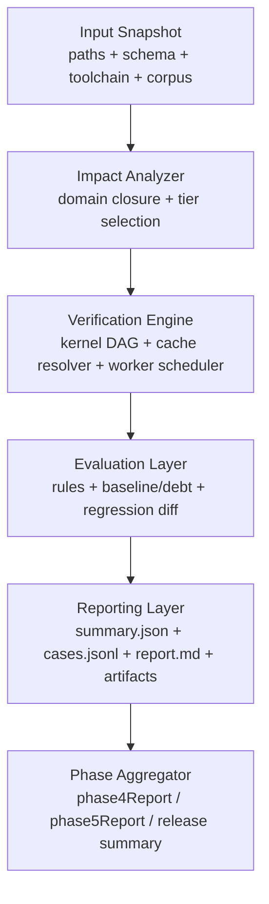
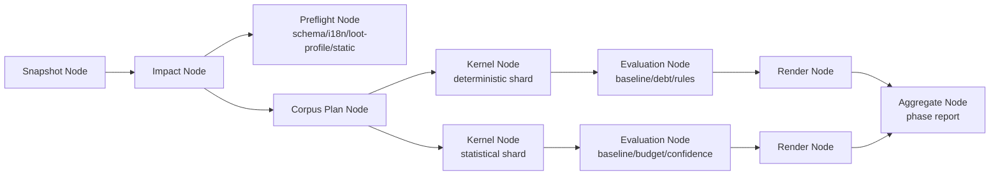

# 全仓统一验证 Contract 与执行架构重构方案

> 日期：2026-04-12  
> 状态：Proposed for execution  
> 适用范围：`Phase 4`、`Phase 5` 以及后续所有 harness / lab / QA / release gate  
> 文档定位：仓库级验证基础设施重构方案；不要求兼容当前 `whiteBox* / *Harness / *Lab / phase4Report` 的手工接线方式  
> 量化门槛权威：仍以 phase checklist 为准；本文件负责定义统一 contract、执行架构、缓存复用、指标与算法

**本轮实施边界**：

1. **先完成基础设施改造 + `Phase 4` 迁移与回绿**
2. **`Phase 5` 本轮只出 domain spec、task design、metric/report 方案，不进入实现**
3. 本轮的成功标准是：`Phase 4` 当前已有验证域迁移到新 contract 后，开发回路明显加快，owner gate 和 phase 聚合可稳定运行
4. 本轮默认**保留现有公开 root task 名称作为稳定 alias**，避免在 `Phase 4` 迁移期同步打碎 checklist、CI 与开发心智

---

## 1. 直接结论

当前验证体系的根问题不是“某个测试写坏了”，而是**验证 contract、执行模型、缓存模型和报告模型没有从一开始按仓库级系统设计**。

现状的结构性缺陷：

1. 静态结构检查、确定性场景、统计 batch、长时 soak 被混在同一层任务体系里。
2. 大量验证任务仍通过 `Gradle Test + @Tag` 包装运行，启动成本高，缓存语义弱，依赖关系表达粗糙。
3. 现有 `whiteBox` 报告格式已经统一，但 baseline / expected debt / regression diff / phase report 聚合仍是散装实现。
4. `Phase 4` 已经进入多域并行验证；`Phase 5` 将进一步引入 `tactical AI / replay / perf / soak / QA / release`，如果继续沿用手写 `dependsOn` 和域内私有规则，维护成本会继续指数上升。
5. 当前缺少“改动影响分析 -> 最小必要验证集 -> 缓存复用 -> 报告聚合”的闭环，导致“一点小改动就炸、炸了还跑很久”。

本方案的根本解法不是补几个测试，而是把验证体系重构为：

1. **统一 Contract 层**
   - 所有验证域声明统一的 domain spec、corpus spec、baseline spec、cache policy、metric catalog。
2. **统一执行引擎**
   - 用专用 `VerificationTask`/engine 替代大部分 `Test + includeTags` harness 包装。
3. **统一缓存与复用层**
   - 以内容指纹驱动的 kernel cache、artifact cache、phase aggregate cache。
4. **统一回归语义**
   - 显式建模 `strict pass / approved debt / expected failure / relative baseline / budget threshold`。
5. **统一 phase 聚合**
   - `phase4Report`、未来的 `phase5Report` 都只消费已有 domain artifact，不直接重新执行 producer。

如果按本方案落地：

1. 小改动首先命中秒级 preflight，不再先炸慢任务。
2. 统计型 / 长时型验证只在真正必要时跑，并能复用已有 kernel 结果。
3. 新回归将以“新增 culprit / 超出 baseline / unexpected regression”出现，而不是“failedAssertions 从 2 变 3”这种低信息量症状。
4. `Phase 5` 的验证任务可以直接生在新 contract 上，不再重复 `Phase 4` 的散装演化过程。

但实施路径必须是**渐进式**而不是一步跳到完整自定义构建系统：

1. 第一阶段优先利用 Gradle 自己的 task graph、incremental input/output、build cache、build service 和 worker API。
2. 只有当 Gradle 原生增量语义无法表达跨 task 的 kernel 复用和节点级 evaluation/render 复用时，才在其上叠加轻量 verification engine。
3. `Phase 4` 迁移阶段允许新旧系统短期并行运行，以旧产物作为交叉验证基准。

---

## 2. 设计目标

### 2.1 目标

1. **从根上降低验证时间**
   - 把静态、确定性、统计、长时任务拆层，做到 first-fail fast。
2. **从根上降低脆弱性**
   - 不再用“失败条数”“整份 JSON 肉眼对比”表达回归。
3. **从根上提升可复用性**
   - 一个 domain 的 kernel 结果可被 white-box、phase report、人工复查、AI triage 复用。
4. **从根上提升可维护性**
   - 新域接入时只声明 spec，不再复制一套 `Runner + Gradle task + baseline + report glue`。
5. **从根上支撑 Phase 5**
   - tactical AI、replay、perf、soak、QA、package 从一开始就走统一 contract。

### 2.2 非目标

1. 不把“游戏是否好玩”的最终判断自动化。
2. 不把所有手工白盒流程替换掉。
3. 不在 `core / game / client` 再造第二套规则真源。
4. 不追求一次性消灭所有历史 debt；但 debt 必须进入显式 baseline/debt contract。

---

## 3. 当前体系的根因分析

### 3.1 任务类型没有分层

当前仓库把以下不同性质的任务放在同一层：

1. **静态结构验证**
   - 例：schema 交叉引用、loot profile overlap、manifest key 完整性、content pack precedence。
2. **确定性场景验证**
   - 例：mapgen pilot、solvability proof、tactical AI fixed scenarios、replay hash consistency。
3. **统计 batch**
   - 例：lootBalanceLab、balanceLab、organicHiddenProbe。
4. **长时系统验证**
   - 例：longRunLab、soakRun、perfSmoke。
5. **聚合报告**
   - 例：phase4Report、未来的 phase5Report。

这些任务的：

1. 输入稳定性
2. 可缓存性
3. 失败语义
4. 运行预算
5. 对开发回路的价值

完全不同，不能继续用同一种 `Gradle Test task + @Tag` 模板承载。

### 3.2 执行入口是 JUnit，不是验证引擎

当前大量任务在 `tools/build.gradle.kts` 中定义为：

```kotlin
tasks.register<Test>("whiteBoxLoot") {
    useJUnitPlatform { includeTags("whiteBoxLoot") }
    dependsOn("lootBalanceLab")
}
```

这带来 4 个问题：

1. 验证被迫走 JUnit 平台启动路径，任务启动成本偏高。
2. domain 级依赖关系只能写成粗粒度 `dependsOn`，无法表达更细的 kernel/result reuse。
3. Gradle 只能把它理解为“跑一个 test task”，很难做精细缓存和输入指纹建模。
4. 任务输出语义弱，只知道“某个 test pass/fail”，不知道“本次是 kernel miss、baseline drift、unexpected regression 还是 report render miss”。

### 3.3 报告格式统一了，回归语义没有统一

现有共享层已经有：

1. `VerificationReportHeader`
2. `WhiteBoxCaseReport`
3. `WhiteBoxAggregateReport`
4. `WhiteBoxReportWriter`

但没有统一：

1. baseline schema
2. approved debt schema
3. unexpected regression schema
4. relative baseline / budget gate / expected failure code 的公共表达

结果是：

1. terrain 有 baseline
2. content-pack 有 expected failure code
3. loot 没 baseline，只能硬写失败条数
4. phase report 需要自己知道每个域的特殊解释规则

### 3.4 缺少输入影响分析

当前没有仓库级“输入 -> domain”依赖图。

因此无法回答这些关键问题：

1. 改了 `loot/index.yaml`，到底需要跑哪些任务？
2. 改了 `RenderSnapshot`，哪些 Phase 4/5 域会失效？
3. 改了 replay schema，是否必须重跑 package/perf/soak？
4. 改了 docs baseline，是否只需要重评估而不需要重跑 kernel？

没有影响分析，就只能“宁愿全跑”，性能自然差。

### 3.5 Kernel 和 Evaluation 没有彻底解耦

当前很多任务是：

1. 生成原始结果
2. 做断言
3. 写 report
4. 输出 phase metric

一次完成。

这会导致：

1. baseline 更新时不得不重跑重型 producer
2. phase report 重建时不得不间接依赖 producer
3. 一个小的 assertion 语义改动，也会拖整个 kernel 重跑

根本上应该拆成：

1. **Kernel**
   - 只负责生成原始 domain result
2. **Evaluation**
   - 负责规则断言和 baseline 对比
3. **Rendering**
   - 负责 summary/jsonl/markdown/artifacts
4. **Aggregation**
   - 负责 phase report

---

## 4. 目标架构

### 4.1 五层结构



### 4.2 以 DAG 为核心的执行图

验证执行必须建模成显式 DAG，而不是一串手写 `dependsOn`。



节点原则：

1. `Snapshot Node`
   - 负责输入快照与指纹生成
2. `Impact Node`
   - 负责输入作用域到 domain/tier 的闭包计算
3. `Preflight Node`
   - 只做静态图验证，不允许依赖重型 kernel
4. `Kernel Node`
   - 只生成原始结果，不做 baseline 判断
5. `Evaluation Node`
   - 只消费 kernel 输出和 baseline/debt spec
6. `Render Node`
   - 只负责报告和 artifact
7. `Aggregate Node`
   - 只消费 Render/Evaluation 输出，禁止触发 producer

### 4.3 DAG 节点分类

```kotlin
enum class VerificationNodeKind {
    SNAPSHOT,
    IMPACT,
    PREFLIGHT,
    KERNEL,
    EVALUATION,
    RENDER,
    AGGREGATE,
}

data class VerificationNodeSpec(
    val nodeId: String,
    val domainId: String,
    val tier: VerificationTier,
    val kind: VerificationNodeKind,
    val dependencies: List<String>,
    val cacheScope: CacheScope,
    val workerClass: WorkerClass,
)
```

`nodeId` 必须稳定且可复用，建议格式：

1. `snapshot::<phase>`
2. `impact::<phase>`
3. `preflight::<domain>`
4. `kernel::<domain>::<corpus>::<shard>`
5. `evaluation::<domain>::<corpus>`
6. `render::<domain>::<tier>`
7. `aggregate::<phase>`

### 4.4 DAG 调度策略

必须使用统一调度器按 DAG 进行执行，而不是靠 Gradle 层手写依赖链。

调度原则：

1. 使用 `Kahn topological sort` 维护可执行节点队列
2. 队列优先级固定为：
   - `PREFLIGHT`
   - `KERNEL`（确定性）
   - `KERNEL`（统计）
   - `KERNEL`（长时）
   - `EVALUATION`
   - `RENDER`
   - `AGGREGATE`
3. 同一 Gradle invocation 内允许多 worker 调度，但只允许一个 Gradle 进程
4. 任何 `PREFLIGHT` 失败，都应直接剪枝掉依赖它的重型节点
5. `AGGREGATE` 节点永远只在所有上游 `RENDER/EVALUATION` 完成后运行

调度器必须支持：

1. `node cache hit` 跳过执行
2. `node cache miss` 只重跑失效节点及其下游
3. `baseline changed` 时，只重跑 `EVALUATION/RENDER/AGGREGATE`
4. `report template changed` 时，只重跑 `RENDER/AGGREGATE`

### 4.5 四类 workload

统一把所有验证域归到 4 个 workload class：

| workload class | 典型任务 | 核心特点 | 默认策略 |
| --- | --- | --- | --- |
| `STATIC_GRAPH` | contractLint、lootProfileLint、contentPack lint、localization schema lint | 无随机性、无运行时模拟 | 秒级、强缓存、PR preflight 首跑 |
| `DETERMINISTIC_SCENARIO` | whiteBoxMapgen、whiteBoxSolvability、tacticalAiHarness、replayHarness、terrainInteractionBatch | 固定场景/固定 seed、结果应哈希一致 | 强缓存、owner gate |
| `STATISTICAL_BATCH` | lootBalanceLab、organicHiddenProbe、balanceLab | 需要样本量与置信区间 | 分 shard 缓存、支持 early stop |
| `LONG_RUNNING_SYSTEM` | longRunLab、perfSmoke、soakRun、packageRelease | 环境敏感、运行时间长 | 分层预算、结果部分缓存、默认不进每次 PR |

### 4.6 Phase 抽象不再绑定 white-box

本方案不把 `whiteBox` 当成唯一命名轴。

统一的核心对象是 `VerificationDomain`，white-box 只是 artifact/view 的一种。

Phase 4 / Phase 5 上统一使用：

1. domain kernel
2. domain evaluation
3. domain report
4. phase aggregate

建议的新命名规则：

1. `verify<Domain>Preflight`
2. `verify<Domain>Owner`
3. `verify<Domain>Full`
4. `report<Phase>`

例如：

1. `verifyLootPreflight`
2. `verifyLootOwner`
3. `verifyLootFull`
4. `reportPhase4`
5. `verifyTacticalAiOwner`
6. `verifyReplayOwner`
7. `verifyPerfFull`
8. `reportPhase5`

### 4.7 渐进式实现策略：Gradle 原生优先

目标架构仍然是 DAG + 节点缓存，但**第一阶段实现不直接再造完整 mini build system**。

第一阶段优先使用：

1. `DefaultTask` / 自定义 `VerificationTask`
2. `@Input` / `@OutputDirectory` / `inputs.property(...)`
3. Gradle build cache
4. Gradle shared build services
5. Gradle worker API

第一阶段不直接引入：

1. 独立于 Gradle 的外部调度器进程
2. 自定义远程缓存协议
3. 完全脱离 Gradle DAG 的第二套执行入口

原因：

1. 当前仓库已经深度绑定 Gradle/Kotlin/libGDX
2. 当前最大收益来自 preflight 抽离、kernel/evaluation 解耦、baseline 统一和 report-only 聚合
3. 团队规模下，完整自定义 DAG 引擎本身会成为新的维护负担

---

## 5. 统一 Contract 设计

### 5.1 核心数据模型

建议新增统一 contract：

```kotlin
enum class VerificationWorkloadClass {
    STATIC_GRAPH,
    DETERMINISTIC_SCENARIO,
    STATISTICAL_BATCH,
    LONG_RUNNING_SYSTEM,
}

enum class VerificationTier {
    PREFLIGHT,
    OWNER,
    FULL,
    NIGHTLY,
    RELEASE,
}

data class VerificationDomainSpec(
    val domainId: String,
    val phaseIds: Set<String>,
    val workloadClass: VerificationWorkloadClass,
    val defaultTier: VerificationTier,
    val inputScopes: List<InputScope>,
    val dependencies: List<String>,
    val corpora: List<VerificationCorpusSpec>,
    val metricSpecs: List<VerificationMetricSpec>,
    val baselinePolicy: BaselinePolicySpec?,
    val cachePolicy: CachePolicySpec,
    val artifactPolicy: ArtifactPolicySpec,
)

data class VerificationCorpusSpec(
    val corpusId: String,
    val tier: VerificationTier,
    val scenarioIds: List<String> = emptyList(),
    val seedList: List<Long> = emptyList(),
    val stopPolicy: StopPolicySpec,
)

sealed interface StopPolicySpec {
    data class ExactCorpus(
        val requiredCases: Int,
    ) : StopPolicySpec

    data class SequentialConfidence(
        val minSamples: Int,
        val maxSamples: Int,
        val confidenceLevel: Double,
        val toleratedHalfWidth: Double,
    ) : StopPolicySpec

    data class TimeBudget(
        val warmupMinutes: Int,
        val maxMinutes: Int,
    ) : StopPolicySpec
}

data class VerificationInputSnapshot(
    val snapshotHash: String,
    val toolchainHash: String,
    val contractVersionHash: String,
    val activePackHash: String,
    val changedScopes: List<String>,
)

data class VerificationKernelResult(
    val domainId: String,
    val corpusId: String,
    val inputSnapshotHash: String,
    val casePayloadPath: String,
    val aggregatePayloadPath: String,
    val fingerprints: Map<String, String>,
)

data class BaselinePolicySpec(
    val mode: BaselineMode,
    val baselinePath: String,
)

enum class BaselineMode {
    STRICT_ZERO_FAILURE,
    APPROVED_DEBT_SET,
    EXPECTED_FAILURE_CODE_SET,
    RELATIVE_BASELINE,
    BUDGET_THRESHOLD,
}
```

### 5.2 Baseline / Debt 的统一表达

必须统一 baseline schema，不允许每个域再私有发明。

建议标准文件：

```json
{
  "baselineId": "phase4-loot-local-identity-v1",
  "metricDefinitionVersion": "1",
  "domainId": "loot",
  "mode": "APPROVED_DEBT_SET",
  "approvedDebtKeys": [
    "sameZoneSecretVsCadence::deep_iron_pit:loot.deep_iron_slag_cache.secret->loot.deep_iron_pit.cadence"
  ],
  "ceilings": {
    "sameZoneSecretVsCadence::deep_iron_pit:loot.deep_iron_slag_cache.secret->loot.deep_iron_pit.cadence": 0.75
  },
  "expectedMetricRanges": {
    "sameZoneSecretVsCadenceMaxOverlap": {
      "max": 0.75
    }
  }
}
```

统一比较语义：

1. **新 debt key 出现** => `unexpected regression`
2. **approved debt 超 ceiling** => `regression`
3. **approved debt 消失** => `improvement`
4. **metric 落在允许带内** => `pass`

### 5.3 Metric Catalog 必须 phase-neutral

当前 `Phase4MetricCatalog` 是 phase 专属、手写 owner task。

新架构要求：

1. 统一存在 `VerificationMetricCatalog`
2. metric 不再直接绑 task 名，而是绑 `domainId + tier`
3. phase report 只做选择与展示，不重新解释回归语义

---

## 6. 模块与文件布局

### 6.1 `core`

`core` 不新增验证引擎 contract。

保留现有：

1. `core.harness.whitebox.*`
   - 作为当前已落地主干的白盒 DTO 与报告头 contract

本轮不新增到 `core` 的内容：

1. `VerificationDomainSpec`
2. `VerificationNodeSpec`
3. `VerificationCacheStore`
4. `VerificationImpactAnalyzer`
5. `VerificationBaselineComparator`
6. Gradle task / build-logic 适配

原因：

1. 这些属于验证基础设施，而不是规则真源
2. 放进 `core` 会模糊 `core` 的边界
3. `Phase 4` / `Phase 5` 的验证引擎应当留在 `tools/build-logic` 体系中

迁移策略：

1. 现有 `core.harness.whitebox.*` 在 `Phase 4` 迁移期继续可用
2. 新 verification engine contract 放在 `tools` 或独立 `build-logic` 中
3. 是否在更后续阶段把 `WhiteBoxContracts` 也完全外迁，等 `Phase 4` 全量迁移完成后再决定

### 6.2 `tools / build-logic`

`tools` 或仓库内 `build-logic` 承载执行引擎和适配层：

```text
build-logic/src/main/kotlin/com/ktome/build/verification/
  VerificationTask.kt
  VerificationReportTask.kt
  VerificationTaskPlugin.kt

tools/src/main/kotlin/com/ktome/tools/verification/
  VerificationDomainSpec.kt
  VerificationNodeSpec.kt
  VerificationExecutionPlanner.kt
  VerificationImpactAnalyzer.kt
  VerificationCacheStore.kt
  VerificationKernelStore.kt
  VerificationBaselineComparator.kt
  VerificationReportRenderer.kt
  VerificationPhaseAggregator.kt
  VerificationTaskRegistry.kt
```

domain adapter 放在各自子目录：

```text
tools/src/main/kotlin/com/ktome/tools/loot/
  LootVerificationDomain.kt
  LootProfileStructureAnalyzer.kt

tools/src/main/kotlin/com/ktome/tools/mapgen/
  MapgenVerificationDomain.kt

tools/src/main/kotlin/com/ktome/tools/hidden/
  HiddenVerificationDomain.kt

tools/src/main/kotlin/com/ktome/tools/contentpack/
  ContentPackVerificationDomain.kt

tools/src/main/kotlin/com/ktome/tools/phase5/
  TacticalAiVerificationDomain.kt
  ReplayVerificationDomain.kt
  PerfVerificationDomain.kt
  SoakVerificationDomain.kt
  QaVerificationDomain.kt
```

### 6.3 `game` harness 的定位

当前仓库里 `game` 侧已经存在一批不属于 `tools` 的 harness：

1. `HeadlessRunHarness`
2. `BossHarnessTest`
3. `LongRunLabTest / LongRunLabFullTest`
4. `HeadlessSmokeSuiteTest`
5. `SoloClearLabV2Test`
6. `TerrainInteractionBatchTest`
7. `WhiteBoxHarnessWriter`

本轮必须明确它们的定位：

1. `HeadlessRunHarness`
   - 继续保留在 `game`，它是**游戏层集成编排器**，不是 `tools` runner 的替代品
2. `BossHarness / LongRunLab / HeadlessSmoke / SoloClear / TerrainInteractionBatch`
   - 继续视为 `game` 域 kernel producer 或集成 harness
3. `WhiteBoxHarnessWriter`
   - 与 `tools.WhiteBoxReportWriter` 存在功能重复，本轮要收敛为**共享报告写入层 + game adapter**

迁移原则：

1. 不重写 `HeadlessRunHarness` 的游戏编排模型
2. 先把 `game` harness 产物接入统一 verification contract
3. 再逐步消除 `game` 与 `tools` 两套 writer 的重复实现

### 6.4 Gradle 层

建议引入 `build-logic` 或仓库内 Gradle plugin，生成验证任务，不再手写成片 `tasks.register<Test>()`。

核心任务类型：

1. `VerificationTask`
   - 跑 domain kernel/evaluator
2. `VerificationReportTask`
   - 只聚合已有 artifact
3. `VerificationBaselineUpdateTask`
   - 显式更新 baseline，不允许隐式刷新
4. `LegacyHarnessAdapterTask`
   - 用于迁移期承接现有 `Test + @Tag` harness

---

## 7. 执行模型与依赖顺序

### 7.1 单次验证的标准 DAG 流水线

统一固定为 8 步：

1. `ResolveDomainSpecs`
2. `BuildInputSnapshot`
3. `ImpactClosure`
4. `RunStaticPreflight`
5. `RunDeterministicOwner`
6. `RunStatisticalOrLongRunning`
7. `EvaluateAgainstBaseline`
8. `RenderReportsAndAggregate`

### 7.2 强制执行顺序

| 顺序 | 层 | 必要性 |
| --- | --- | --- |
| 1 | 输入快照与影响分析 | 必须最先做；决定后续是否需要跑重任务 |
| 2 | 静态 preflight | 必须先于一切 stochastic/long-running 任务 |
| 3 | 确定性 owner harness | 在静态通过后执行，提供第一层行为证据 |
| 4 | 统计 owner harness | 仅当输入命中相关域或显式请求时运行 |
| 5 | full/nightly/release harness | 默认不进每次开发回路 |
| 6 | phase report | 永远只消费 artifact，不触发 producer |

### 7.3 DAG 调度下的并行原则

仓库当前规则要求：

1. 同一时刻只允许一个 Gradle 进程
2. 不并发跑多个 `./gradlew`

新架构继续遵守这一点，但在**同一个 Gradle invocation 内**由 DAG 调度器控制并行：

1. `STATIC_GRAPH`
   - 按 domain 并行
2. `DETERMINISTIC_SCENARIO`
   - 按 corpus case shard 并行
3. `STATISTICAL_BATCH`
   - 按 shard 并行，必须固定 shard seed range
4. `LONG_RUNNING_SYSTEM`
   - 默认串行或隔离执行，不与 perf/soak 互相抢资源

并行前提：

1. 每个 worker 只消费不可变 input snapshot
2. PRNG shard 使用固定 seed partition
3. 输出合并顺序固定

额外要求：

1. `STATIC_GRAPH` 节点可最大化并行
2. `DETERMINISTIC_SCENARIO` 仅允许在同一 domain 的 shard 内并行，不跨 domain 共享可变上下文
3. `STATISTICAL_BATCH` 只允许 shard 级并行，必须记录 `shardId / shardSeedRange`
4. `LONG_RUNNING_SYSTEM` 默认独占 worker class，禁止与 `perf/soak/package` 同机混跑

### 7.4 Phase 4 当前 DAG 目标图

本轮实现必须先把 `Phase 4` 当前已有任务收敛到统一 DAG 上。

```mermaid
flowchart TD
    S["snapshot::phase4"] --> I["impact::phase4"]
    I --> P_SCHEMA["preflight::schema"]
    I --> P_I18N["preflight::i18n"]
    I --> P_LOOT["preflight::loot"]
    I --> P_HIDDEN["preflight::hidden"]
    I --> P_PACK["preflight::content-pack"]

    I --> K_MAPGEN["kernel::mapgen::full"]
    I --> K_SOLV["kernel::solvability::full"]
    I --> K_LOOT["kernel::loot::owner/full shards"]
    I --> K_HIDDEN["kernel::hidden::owner"]
    I --> K_PROBE["kernel::organic-hidden::full shards"]
    I --> K_TERRAIN["kernel::terrain::owner"]
    I --> K_BOSS["kernel::boss::owner"]
    I --> K_LONGRUN["kernel::longrun::full/nightly shards"]
    I --> K_PACK["kernel::content-pack::owner"]

    P_LOOT --> E_LOOT["evaluation::loot"]
    K_LOOT --> E_LOOT
    K_MAPGEN --> E_MAPGEN["evaluation::mapgen"]
    K_SOLV --> E_SOLV["evaluation::solvability"]
    K_HIDDEN --> E_HIDDEN["evaluation::hidden"]
    K_PACK --> E_PACK["evaluation::content-pack"]
    K_TERRAIN --> E_TERRAIN["evaluation::terrain"]
    K_BOSS --> E_BOSS["evaluation::boss"]
    K_LONGRUN --> E_LONGRUN["evaluation::longrun"]
    K_PROBE --> E_PROBE["evaluation::organic-hidden"]

    E_LOOT --> R_LOOT["render::loot"]
    E_MAPGEN --> R_MAPGEN["render::mapgen"]
    E_SOLV --> R_SOLV["render::solvability"]
    E_HIDDEN --> R_HIDDEN["render::hidden"]
    E_PACK --> R_PACK["render::content-pack"]
    E_TERRAIN --> R_TERRAIN["render::terrain"]
    E_BOSS --> R_BOSS["render::boss"]
    E_LONGRUN --> R_LONGRUN["render::longrun"]
    E_PROBE --> R_PROBE["render::organic-hidden"]

    R_LOOT --> A4["aggregate::phase4"]
    R_MAPGEN --> A4
    R_SOLV --> A4
    R_HIDDEN --> A4
    R_PACK --> A4
    R_TERRAIN --> A4
    R_BOSS --> A4
    R_LONGRUN --> A4
    R_PROBE --> A4
```



### 7.5 推荐任务族

#### 开发态

```bash
./gradlew verifyChanged
./gradlew verifyChangedReportOnly
./gradlew verifyOwner
```

#### Phase 级

```bash
./gradlew verifyPhase4
./gradlew verifyPhase5
./gradlew reportPhase4
./gradlew reportPhase5
```

#### 发布态

```bash
./gradlew verifyRelease
./gradlew reportRelease
```

---

## 8. 缓存与复用设计

### 8.1 总原则

缓存必须是**内容寻址（content-addressable）**，而不是“任务名 + 最近一次结果”。

缓存 key 至少包含：

1. `domainId`
2. `tier`
3. `corpusId`
4. `inputSnapshotHash`
5. `runnerVersion`
6. `contractVersionHash`
7. `toolchainHash`
8. `activePackHash`
9. `locale`
10. `environmentClass`
11. `nodeKind`
12. `nodeId`

### 8.2 缓存层级

| 层级 | 内容 | 是否缓存 | 备注 |
| --- | --- | --- | --- |
| `L1` | schema 解析 / registry 构建 | 是 | 高命中、低成本、PR 必开 |
| `L2` | corpus 展开结果 | 是 | seeds/scenarios 展开后强缓存 |
| `L3` | domain kernel result | 是 | 最关键缓存层 |
| `L4` | baseline/evaluation result | 是 | baseline 变更时只重评估，不重跑 kernel |
| `L5` | markdown / artifact render | 是 | render 改动只重渲染 |
| `L6` | phase aggregate report | 是 | `reportOnly` 只消费 L4/L5 |

### 8.3 节点级缓存语义

必须按 DAG 节点种类缓存，而不是按“整个任务”缓存。

| node kind | 缓存 key 核心维度 | 失效条件 | 可复用下游 |
| --- | --- | --- | --- |
| `SNAPSHOT` | changed paths + toolchain + active packs | 输入文件/工具链变化 | 全部 |
| `IMPACT` | snapshot hash + domain registry version | input scope/registry 变化 | 任务选择 |
| `PREFLIGHT` | snapshot hash + preflight analyzer version | 静态规则/analyzer 变化 | evaluation/aggregate |
| `KERNEL` | snapshot hash + corpus + shard + runner version | domain runtime/corpus 变化 | evaluation/render |
| `EVALUATION` | kernel hash + baseline hash + metric catalog version | baseline/metric 变化 | render/aggregate |
| `RENDER` | evaluation hash + renderer template version | 模板/输出格式变化 | aggregate |
| `AGGREGATE` | set(render hashes) + phase metric catalog version | 任一上游 render/metric 变化 | 无 |

### 8.4 哪些可以缓存

#### 可强缓存

1. `contractLint`
2. `lootProfileLint`
3. `contentPack lint`
4. `mapgen fixed corpus`
5. `solvability fixed corpus`
6. `tacticalAiHarness`
7. `replayHarness`
8. `terrainInteractionBatch`
9. `whiteBox*` / phase report render

#### 可分 shard 缓存

1. `lootBalanceLab`
2. `organicHiddenProbe`
3. `balanceLab`
4. `longRunLab`

这些任务应把一个大 corpus 拆成可复用 shard：

1. `scenario x seedRange`
2. `build x seedSlice`
3. `zone x sourceTier x magicFindSlice`

#### 仅本机缓存 / 不可跨环境复用

1. `perfSmoke`
2. `soakRun`
3. `packageRelease`

原因：

1. 与机器、图形、音频、打包环境强相关
2. 可以缓存原始观测文件和渲染结果
3. 不建议把最终 verdict 跨环境复用

### 8.5 哪些必须复用

1. `reportPhase4 / reportPhase5`
   - 只读已有 artifact，绝不重跑 producer
2. `whiteBoxLoot`
   - 直接复用 loot kernel result + structure lint result
3. `tacticalAi` fixed-scenario 白盒
   - 复用 tactical kernel trace，不再重复模拟
4. `replay` report / death analysis
   - 复用 replay kernel 输出，不重复 replay 运行

### 8.6 Cache store 目录

建议目录：

```text
tools/build/verification-cache/
  snapshots/
  corpora/
  kernels/
  evaluations/
  artifacts/
  phase-reports/
```

可选增加远端 cache：

1. CI artifact cache
2. 构建机共享 cache

但第一阶段只要求本地内容寻址缓存成立。

### 8.7 缓存 key 分层

缓存 key 不直接平铺一个超长 12 维元组，而是分成两层：

1. `global scope`
   - `toolchainHash`
   - `activePackHash`
   - `locale`
   - `environmentClass`
2. `node scope`
   - `domainId`
   - `tier`
   - `corpusId`
   - `inputSnapshotHash`
   - `runnerVersion`
   - `contractVersionHash`
   - `nodeKind`
   - `nodeId`

策略：

1. `global scope` 变化时，统一失效对应环境下的节点缓存
2. `node scope` 变化时，只失效命中的节点子图

这样既保持内容寻址，又避免无意义地压低命中率。

---

## 9. 影响分析与最小必要验证

### 9.1 Input Scope 模型

每个 domain spec 必须声明自己的 `inputScopes`：

```kotlin
data class InputScope(
    val scopeId: String,
    val pathPrefixes: List<String> = emptyList(),
    val contractIds: List<String> = emptyList(),
    val tagIds: List<String> = emptyList(),
)
```

示例：

1. `loot`
   - `game/src/main/resources/data/items/`
   - `game/src/main/resources/data/loot/`
   - `game/src/main/kotlin/com/ktome/game/loot/`
   - `contractIds = ["LootBudget", "ItemDataBundle", "SpecialTierEligibility"]`
2. `replay`
   - `core/src/main/kotlin/com/ktome/core/replay/`
   - `contractIds = ["ReplaySchema", "RunSemanticHash"]`
3. `tactical-ai`
   - `core/src/main/kotlin/com/ktome/core/ai/`
   - `contractIds = ["TacticalAIDecisionTrace", "PerceptionState"]`

### 9.2 影响分析算法

步骤：

1. 收集 changed files
2. 解析匹配的 input scopes
3. 映射到 directly impacted domains
4. 按 domain dependency 做传递闭包
5. 选择最低必要 tier

例子：

1. 改 `loot/index.yaml`
   - 命中 `loot` domain
   - 先跑 `verifyLootPreflight`
   - 若只改静态池结构，不必先跑 `longRunLab`
2. 改 `ReplayHeader`
   - 命中 `replay`
   - 传递命中 `phase5Report`、`packageRelease`
3. 改 `TerrainTag`
   - 命中 `mapgen / solvability / terrain / tactical-ai / perf`

### 9.3 false negative 兜底策略

影响分析必须显式处理 false negative 风险。

第一阶段兜底规则：

1. 改动命中 `core/src/main/kotlin/com/ktome/core/`
   - 默认触发受影响 phase 的更宽验证集，不完全依赖 input scope 声明
2. 改动命中共享运行时装配层
   - 如 `game/data/DataLoader`、`FoundationGameSession`、`HeadlessRunHarness`
   - 默认扩大到所有直接消费这些装配层的 domain
3. scope 匹配为空但命中关键目录
   - 直接回退到 phase 级 owner 验证，而不是判定“无需验证”

同时必须补一个 `scopeCoverageLint`：

1. 基于 import / package dependency / domain registry 做静态对账
2. 检查 `inputScopes` 是否覆盖了实际运行时依赖
3. 初期宁可过宽，不允许过窄

---

## 10. 回归语义与报告设计

### 10.1 回归分类

统一只允许 5 类 verdict：

1. `PASS`
2. `APPROVED_DEBT`
3. `IMPROVED_DEBT`
4. `UNEXPECTED_REGRESSION`
5. `INFRA_FAILURE`

不再只输出“failedAssertions = N”。

### 10.2 每个 domain summary 顶层字段

建议统一输出：

```json
{
  "domainId": "loot",
  "tier": "OWNER",
  "verdict": "APPROVED_DEBT",
  "unexpectedRegressionCount": 0,
  "approvedDebtCount": 2,
  "improvedDebtCount": 1,
  "infraFailureCount": 0,
  "cacheStatus": "HIT",
  "kernelReuseSource": "verification-cache/kernels/...",
  "firstUnexpectedKey": null,
  "firstInfraFailure": null
}
```

### 10.3 必须增加的仓库级元指标

| 指标 | 用途 |
| --- | --- |
| `taskWallMs` | 总时长 |
| `snapshotBuildMs` | 输入快照耗时 |
| `kernelWallMs` | kernel 执行耗时 |
| `evaluationWallMs` | baseline/evaluation 耗时 |
| `renderWallMs` | report 渲染耗时 |
| `cacheHitRate` | 命中率 |
| `cacheMissReasonHistogram` | 失效原因 |
| `unexpectedRegressionCount` | 新回归数 |
| `approvedDebtCount` | 历史 debt 数 |
| `improvedDebtCount` | debt 改善数 |
| `domainArtifactBytes` | artifact 体积 |
| `rerunCount` | 单次流水线内重跑次数 |

这些指标必须进入：

1. domain summary
2. phase report
3. CI summary

### 10.4 Domain-specific 关键指标

#### Phase 4

1. `loot`
   - `sameZoneSecretVsCadenceMaxOverlap`
   - `sameZoneSecretVsRewardMaxOverlap`
   - `unexpectedLocalIdentityPairCount`
   - `kernelRollsUsed`
   - `confidenceHalfWidth`
2. `longRun`
   - `terminalWeaponBaseDiversity`
   - `crossProfessionTopWeaponDominance`
   - `professionAlignedWeaponAdoptionRate`
   - `fullRouteSampleCount`
3. `hidden`
   - `scriptedHiddenVerificationRate`
   - `organicHiddenDiscoveryRate`
   - `primerFreeDiscoveryRate`

#### Phase 5

1. `tactical-ai`
   - `actionFamilyMatchRate`
   - `illegalTargetCount`
   - `aiTraceHashConsistencyRate`
   - `selectionReasonDistribution`
2. `replay`
   - `runSemanticHashConsistencyRate`
   - `runTraceHashConsistencyRate`
   - `frameMismatchCount`
3. `perf`
   - `p50/p95 frame time`
   - `madSpikeCount`
   - `heapDriftSlope`
4. `soak`
   - `oomCount`
   - `maxGcPauseMs`
   - `heapDriftMb`
   - `handleDelta`
5. `qa`
   - `unresolvedKeyCount`
   - `placeholderMismatchCount`
   - `contrastViolationCount`
   - `keyboardFlowFailureCount`

---

## 11. 算法建议

### 11.1 输入快照与缓存

| 问题 | 推荐算法/方法 | 用途 |
| --- | --- | --- |
| 输入指纹 | `BLAKE3` 或 `SHA-256` + Merkle manifest | 对 path set、contract version、toolchain 做稳定快照 |
| 依赖排序 | `Kahn topological sort` | 按 domain dependency 执行 |
| 影响传播 | reverse dependency closure | 从 changed scope 扩到 impacted domains |

### 11.2 统计任务加速

| 任务类型 | 推荐算法 | 作用 |
| --- | --- | --- |
| 二项分布率估计 | `Wilson score interval` | 用于 clear rate、match rate、discovery rate |
| 顺序停止 | `Sequential fixed-width CI` 或 `SPRT` | 达到足够置信度时提前停止，不必总跑固定大样本 |
| 均值/方差 | `Welford online algorithm` | 流式统计，无需保全量样本 |
| 百分位 | `t-digest` 或 `HDR Histogram` | `perfSmoke / soak / affix budget P95` |
| 分布比较 | `Jensen-Shannon divergence` + per-bucket guardrail | 比纯 bucket diff 更稳健 |

说明：

1. `Wilson / Welford / t-digest / MAD` 可直接进入第一阶段实现。
2. `SPRT / Sequential fixed-width CI` 作为后续优化保留，不进入本轮 `Phase 4` 迁移实现。
3. 原因：
   - 迁移期不应同时引入统计方法变化和基础设施重构
   - 多 metric 顺序检验还涉及多重检验校正
4. 第一阶段仍以固定样本量 + shard 缓存 + evaluation-only 重跑为主。

### 11.3 perf / soak 稳定性分析

| 问题 | 推荐算法 | 用途 |
| --- | --- | --- |
| 尖峰检测 | `Median Absolute Deviation` | 检测单场景 `>10%` 异常尖峰 |
| 堆漂移 | online linear regression slope | 看 warmup 后内存趋势，不靠两点差值 |
| trace hash | stable semantic hashing | replay / AI / run trace 一致性 |

### 11.4 Static graph / overlap 分析

| 问题 | 推荐算法 | 用途 |
| --- | --- | --- |
| overlap/subset | exact set diff + culprit key | 精确定位 profile pool 漂移 |
| 依赖环 | `Tarjan SCC` | content pack / graph / schema cycle 检测 |
| key 完整性 | bipartite resolution matrix | i18n / visual / audio / manifest 对账 |

---

## 12. Phase 4 任务映射

| 现有任务 | 新 domain/tier | workload class | 是否缓存 | 是否复用 |
| --- | --- | --- | --- | --- |
| `contractLint` | `schema/PREFLIGHT` | `STATIC_GRAPH` | 强缓存 | phase report 复用 |
| `localeLint` | `i18n/PREFLIGHT` | `STATIC_GRAPH` | 强缓存 | QA report 复用 |
| `mapgenSmoke` | `mapgen/FULL` | `DETERMINISTIC_SCENARIO` | 强缓存 | white-box / phase4 复用 |
| `whiteBoxMapgen` | `mapgen/OWNER` | `DETERMINISTIC_SCENARIO` | 复用 `mapgen` kernel | 只评估+渲染 |
| `solvabilityHarness` | `solvability/FULL` | `DETERMINISTIC_SCENARIO` | 强缓存 | white-box / phase4 复用 |
| `whiteBoxSolvability` | `solvability/OWNER` | `DETERMINISTIC_SCENARIO` | 复用 `solvability` kernel | 只评估+渲染 |
| `lootBalanceLab` | `loot/OWNER|FULL` | `STATISTICAL_BATCH` | shard 缓存 | long-run / white-box 复用 |
| `whiteBoxLoot` | `loot/OWNER` | `STATIC_GRAPH + EVALUATION` | 复用 `loot` kernel + static preflight | phase4 复用 |
| `hiddenContentHarness` | `hidden/OWNER` | `DETERMINISTIC_SCENARIO` | 强缓存 | white-box / phase4 复用 |
| `organicHiddenProbe` | `hidden/FULL` | `STATISTICAL_BATCH` | shard 缓存 | phase4 复用 |
| `terrainInteractionBatch` | `terrain/OWNER` | `DETERMINISTIC_SCENARIO` | 强缓存 | phase4 复用 |
| `bossHarness` | `boss/OWNER` | `DETERMINISTIC_SCENARIO` | 强缓存 | phase4 复用 |
| `longRunLab` | `longrun/FULL|NIGHTLY` | `LONG_RUNNING_SYSTEM` | shard 缓存 | phase4 复用 |
| `contentPackHarness` | `content-pack/OWNER` | `STATIC_GRAPH + DETERMINISTIC_SCENARIO` | 强缓存 | white-box / phase4 复用 |
| `whiteBoxHiddenContent` | `hidden/OWNER` | `EVALUATION` | 复用 hidden kernel | phase4 复用 |
| `whiteBoxContentPack` | `content-pack/OWNER` | `EVALUATION` | 复用 content-pack kernel | phase4 复用 |
| `phase4Report` | `phase4/AGGREGATE` | `REPORT_ONLY` | 强缓存 | 不跑 producer |

**必须新增的 Phase 4 preflight**

1. `verifyLootPreflight`
2. `verifyHiddenPreflight`
3. `verifyContentPackPreflight`

其中 `verifyLootPreflight` 必须成为修改 `items/index.yaml / loot/index.yaml / world_graph.yaml / game/loot/*` 时的第一发现入口。

### 12.1 命名迁移策略

虽然内部 contract 采用 `verify<Domain><Tier>` 命名，但 `Phase 4` 迁移期默认保留这些外部 alias：

1. `lootBalanceLab`
2. `whiteBoxLoot`
3. `phase4Report`
4. 其余 checklist 中已经冻结的 root task 名

原则：

1. `Phase 4` 迁移期先保证行为迁移，不先强制改所有任务名
2. 新内部任务名与 node/domain 语义可并存
3. 是否在 `Phase 5` 前后统一对外命名，再单独决策

---

## 13. Phase 5 设计映射（本轮不实现）

`Phase 5` 目前只有文档，没有实现。结论很明确：

1. **Phase 5 不应复刻当前 Phase 4 的手工 task 演化方式**
2. **Phase 5 的所有 harness 应直接生在新 contract 上**
3. **本轮只输出 domain spec、DAG、cache policy、metric/report 方案，不进入实现与迁移**

| 规划任务 | domain/tier | workload class | 缓存策略 | baseline 策略 |
| --- | --- | --- | --- | --- |
| `tacticalAiHarness` | `tactical-ai/OWNER` | `DETERMINISTIC_SCENARIO` | 强缓存 | `STRICT_ZERO_FAILURE` |
| `replayHarness` | `replay/OWNER` | `DETERMINISTIC_SCENARIO` | 强缓存 | `STRICT_ZERO_FAILURE` |
| `perfSmoke` | `perf/FULL` | `LONG_RUNNING_SYSTEM` | 本机缓存 raw result | `BUDGET_THRESHOLD` |
| `soakRun` | `soak/NIGHTLY|RELEASE` | `LONG_RUNNING_SYSTEM` | 本机缓存 raw samples | `BUDGET_THRESHOLD` |
| `localizationQa` | `qa-localization/OWNER` | `STATIC_GRAPH + DETERMINISTIC_SCENARIO` | 强缓存 | `STRICT_ZERO_FAILURE` |
| `accessibilityQa` | `qa-accessibility/OWNER` | `STATIC_GRAPH + DETERMINISTIC_SCENARIO` | 强缓存 | `STRICT_ZERO_FAILURE` |
| `balanceLab` | `balance/FULL|NIGHTLY` | `STATISTICAL_BATCH` | shard 缓存 | `BUDGET_THRESHOLD` |
| `contentPackHarness` | `content-pack/OWNER` | `STATIC_GRAPH + DETERMINISTIC_SCENARIO` | 强缓存 | `EXPECTED_FAILURE_CODE_SET` |
| `packageRelease` | `release/RELEASE` | `LONG_RUNNING_SYSTEM` | 仅缓存 build artifact | `STRICT_ZERO_FAILURE` |
| `phase5Report` | `phase5/AGGREGATE` | `REPORT_ONLY` | 强缓存 | N/A |

**Phase 5 必须从第一天就具备的报告产物**

1. `tactical-ai`
   - scenario trace
   - candidate scoring table
   - aiTraceHash
2. `replay`
   - semantic hash
   - trace hash
   - frame mismatch diff
3. `perf`
   - frame-time histogram
   - spike timeline
4. `soak`
   - heap drift curve
   - GC pause histogram
   - handle delta curve

---

## 14. 统一 Phase Report 设计

### 14.1 `reportPhase4` / `reportPhase5` 的职责

只负责：

1. 汇总 domain artifact
2. 应用 phase metric catalog
3. 生成 phase summary markdown/json
4. 标记：
   - `unexpectedRegressionCount`
   - `approvedDebtCount`
   - `improvedDebtCount`
   - `cacheHitRate`

明确禁止：

1. 重新执行 producer
2. 重算 domain kernel
3. 从 markdown 反推 metric

### 14.2 Phase report 顶层必须新增字段

1. `phaseVerdict`
2. `unexpectedRegressionCount`
3. `approvedDebtCount`
4. `improvedDebtCount`
5. `domainCacheHitRate`
6. `slowestDomain`
7. `topInvalidationReasons`
8. `artifactReuseRate`

### 14.3 迁移期并行运行

`Phase 4` 迁移期间，必须允许旧 report 与新 report 并行运行一段时间。

要求：

1. 新系统生成的 `reportPhase4` 结果，与旧 `phase4Report` 在关键 owner metric 上做对账
2. 若关键 metric 不一致，优先阻断迁移，不直接替换旧任务
3. 旧 report 至少保留到：
   - `Phase 4` 当前所有 owner domain 都已迁完
   - `Phase 4` 两轮稳定回归无偏差

---

## 15. 实施顺序

### 15.1 总体原则

本轮实施顺序必须固定为：

1. 先完成统一 contract、DAG 调度器、节点级缓存骨架
2. 先把 `Phase 4` 当前已有验证域迁移到新体系并回绿
3. 先让 `reportPhase4` 变成只读 artifact 的聚合器
4. `Phase 5` 只在最后补设计，不进入本轮代码迁移范围

### 15.2 不做什么

本轮明确不做：

1. 不改变普通 unit test 的运行方式，`./gradlew test` 仍然走标准 JUnit
2. 不把远程缓存作为第一阶段前提，第一阶段只做本地缓存
3. 不重写 `HeadlessRunHarness` 的运行时编排
4. 不在 `Phase 4` 迁移期大规模重命名对外 task
5. 不让 `Phase 5` 任务进入本轮实现

### 15.3 基线采集与成功度量

在任何迁移开始前，必须先采集当前 `Phase 4` 验证耗时基线：

1. `contractLint`
2. `localeLint`
3. `whiteBoxLoot`
4. `lootBalanceLab`
5. `phase4Report`
6. `phase4ReportOnly`
7. `longRunLab`

第一阶段目标不是绝对秒杀，而是达到以下可验证改进：

1. 静态 preflight：
   - 本机 warm run 目标 `<= 5s`
2. report-only 聚合：
   - 本机 warm run 目标 `<= 15s`
3. baseline/evaluation-only 重跑：
   - 本机 warm run 目标 `<= 10s`
4. `loot` 改动但未命中 long-run/runtime heavy path 时：
   - 默认路径不应先触发 `longRunLab`
5. `Phase 4` owner 级常见改动路径：
   - 相对当前基线至少减少 `40%` 的 wall time

这些目标以**同机对比、同输入对比**为准，不跨机器比较。

### Sprint 1：统一 Contract、DAG 调度器与节点缓存骨架

目标：

1. 建立 `VerificationContracts`
2. 建立 `VerificationDomainSpec`
3. 建立 `VerificationNodeSpec`
4. 建立 `VerificationExecutionPlanner`
5. 建立 `VerificationCacheStore`
6. 建立 `VerificationBaselineComparator`
7. 建立 `VerificationTask` / `VerificationReportTask`

验收：

1. 新框架能跑一个最小 demo domain：`contractLint` 或 `localeLint`
2. 节点 DAG 可视化与拓扑执行成立
3. 不依赖 JUnit `@Tag`

实现顺序补充口径：

1. 上述目标代表**目标架构的完整终态**，不是对 `PR-01` 范围的逐条硬绑定
2. 若当前 PR 拆分先以 `Gradle-native task + domain/node contract + demo domain` 止痛，则允许：
   - 先把 `dependsOn` 冻结为 contract-only 字段
   - 先保留 legacy adapter 的显式 `selectedClasses`
3. 但一旦后续开始引入真实多 node domain，尤其是 `kernel -> evaluation -> render` 或同 tier 多 node 路径，就必须补 dedicated planner/executor，把 `dependsOn` 从 contract-only 升级为执行语义
4. `tag-only classpath discovery` 不属于 DAG/planner 主线能力；它只在 legacy adapter 长期保留且 class list 漂移已形成维护负担时才值得单独补

### Sprint 1.5：统一 baseline schema 与迁移脚本

目标：

1. 引入统一 baseline schema，包含 `schemaVersion`
2. 提供 terrain 等现有 baseline 的一次性迁移脚本
3. 建立 approved debt / expected failure / relative baseline 的公共比较器

验收：

1. 现有 `terrain baseline` 能被新 schema 读取
2. `loot/content-pack` 能在新 schema 下表达 debt/expected failure

### Sprint 2：迁移 Phase 4 的静态 preflight 与确定性 owner 域

目标：

1. 迁移 `contractLint / localeLint`
2. 迁移 `mapgen / solvability / terrain / boss`
3. 建立 `verifyLootPreflight`
4. 建立 `verifyHiddenPreflight`
5. 建立 `verifyContentPackPreflight`
4. phase4 report 改成只读 artifact

验收：

1. `reportPhase4` 不再 `dependsOn` producer
2. `verifyLootPreflight` 秒级可用
3. `Phase 4` 的静态和确定性 DAG 节点可缓存重放
4. 保留旧任务作为 fallback alias，支持并行对账

### Sprint 3：迁移 Phase 4 的统计域与重型域复用模型

目标：

1. 迁移 `lootBalanceLab`
2. 迁移 `organicHiddenProbe`
3. 迁移 `longRunLab`
4. 建立 shard cache 与 early stop

验收：

1. 相同输入下二次运行命中 kernel cache
2. baseline 改动只重评估不重跑 kernel
3. `longRunLab` 至少支持 shard 级复用，不再整批重跑

### Sprint 4：Phase 4 全面回绿与 gate 重排

目标：

1. `verifyPhase4`
2. `reportPhase4`
3. `verifyChanged`
4. `verifyOwner`
5. `verifyChangedReportOnly`

验收：

1. `Phase 4` 当前 owner gate 全部通过新 contract 运行
2. 修改 `Phase 4` 相关输入时，默认先命中 preflight，再按 impact 选择必要重任务
3. `phase4Report` 完全不触发 producer
4. 当前“改一点就炸、炸了还跑很久”的主痛点在 `Phase 4` 范围内被解除

### Sprint 5：Phase 5 设计封版（仅文档，不实现）

目标：

1. 输出 `Phase 5` domain spec
2. 输出 `Phase 5` DAG
3. 输出 `Phase 5` cache policy
4. 输出 `Phase 5` metric / baseline / report schema
5. 输出 `reportPhase5` 设计
6. 明确 `Phase 5` 实施不依赖旧式 `Test + includeTags`

验收：

1. `Phase 5` 文档可直接指导后续实现
2. 不在本轮引入 `Phase 5` 代码迁移与任务实现
3. `Phase 4` 已经稳定在新体系上，再进入 `Phase 5`

### 15.4 回滚与迁移失败策略

若迁移中途发现新体系存在设计缺陷，必须允许快速回退：

1. 每个迁移域都保留旧 task alias 和旧 report 作为 fallback
2. 新旧系统在至少一个稳定窗口内并行运行
3. 若出现：
   - 缓存失效误判
   - 节点依赖缺失
   - metric 对账不一致
   - report 聚合缺字段
   则回退到旧任务链继续承担正式 gate
4. 新系统只有在：
   - 关键 metric 对账一致
   - 两轮稳定回归通过
   - phase report 字段齐全
   后才能替换旧系统

---

## 16. 最终决策

必须拍板的设计决策：

1. **用专用验证引擎替代大部分 `Gradle Test + @Tag` harness 包装**
2. **按 `STATIC_GRAPH / DETERMINISTIC_SCENARIO / STATISTICAL_BATCH / LONG_RUNNING_SYSTEM` 四类 workload 分层**
3. **严格拆开 kernel / evaluation / rendering / aggregation**
4. **所有 debt、baseline、expected failure 统一建模**
5. **所有 phase report 都只消费 artifact，不重跑 producer**
6. **Phase 5 从第一天直接生在新 contract 上，不兼容旧 white-box 手工接线**

这 6 条不成立，就不会真正解决：

1. 测试慢
2. 一改就炸
3. 炸了难定位
4. phase4/phase5 验证体系继续膨胀

---

## 17. 对当前仓库的直接影响评估

若按本方案执行，首轮重构的实际影响面：

1. `core`
   - 新增统一 verification DTO 与 baseline contract
2. `tools`
   - 新增 verification engine
   - 重构现有 phase4 domain runner 接入层
   - 重构 phase4Report
3. `build logic`
   - 从手写 `tasks.register<Test>` 迁移到 declarative verification task
4. `Phase 5`
   - 所有 harness 从新 contract 直接起步

对生产逻辑的影响原则上应为：

1. 不改变规则真源
2. 只要求必要的结构化 artifact 输出
3. 只在缺少 domain trace 的地方补观测面

这就是“从根上解决”，而不是继续围着某个单独测试修补。
