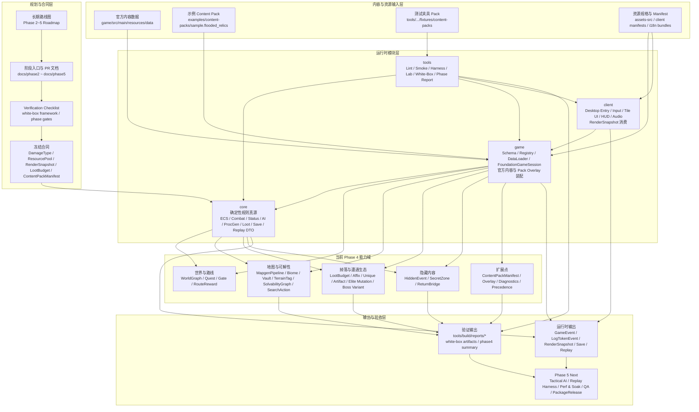

# K-ToME 项目架构图

本文档提供仓库当前基线下的静态架构视图。重点不是展示某个单文件调用链，而是固定：

1. 权威文档与冻结合同如何约束实现。
2. `core / game / client / tools` 如何分层。
3. 官方 data、content pack、asset manifest 与 white-box/report 如何接入主路径。
4. 当前 `Phase 4` 和下一阶段 `Phase 5` 的落点在哪里。

## 读图要点

1. `core` 仍是唯一规则真源，不能被 `game`、`client` 或 `tools` 反向污染。
2. `game` 的职责不是重新定义规则，而是把官方内容和 content pack 装配到 `core` 的 typed contract 上。
3. `client` 只消费 `RenderSnapshot`、事件和 manifest，不直接决定战斗、掉落、AI 或地图规则。
4. `tools` 不是附属脚本目录，而是正式门禁 owner；`phase4Report`、white-box 与 harness 都在这里收口。
5. `Phase 4` 的核心不是单个功能，而是把 `ProcGen + Loot + Hidden Content + Content Pack` 统一接到一套稳定合同与报告路径上。
6. `Phase 5` 会直接消费当前 runtime output 和 verification output，而不是再造第二套 trace 或 QA 语义。
