# K-ToME 功能流程图

本文档提供当前项目主线的动态流程视图。它描述的是“一个正式 run 如何从启动走到验证收口”，同时把 `Phase 4` 的 ProcGen、Loot、Hidden Content、Content Pack 以及 `Phase 5` 的下一步衔接放到同一条链路里。

```mermaid
flowchart TD
    start["启动客户端或 Harness"] --> entry["选择 Locale / New Game / Continue / Pack Selection"]
    entry --> loader["DataLoader 载入官方 data<br/>schema / i18n / visual / audio / registries"]

    loader --> packCheck{"是否启用 Content Pack"}
    packCheck -->|否| catalog["构建官方 SchemaCatalog"]
    packCheck -->|是| manifest["解析 ContentPackManifest<br/>namespace / dependency / versionRange / diagnostics"]
    manifest --> overlay["应用 Overlay<br/>ADD + whole-entry REPLACE<br/>并产出结构化失败诊断"]
    overlay --> catalog

    catalog --> session["FoundationGameSession 组装运行时<br/>world graph / zone reward / loot profile / registries"]
    session --> zoneEnter["进入 Zone<br/>选择 route / floor / reward context"]
    zoneEnter --> mapgen["MapgenPipeline 生成地图<br/>biome / pattern room / vault / terrain tag"]
    mapgen --> solve["SolvabilityGraph 校验<br/>critical path / hidden entrance / search proof / return bridge"]

    solve --> solvable{"主线可达且合同成立"}
    solvable -->|否| failFast["Fail Fast<br/>保留 seed / proof / diagnostics / report artifact"]
    solvable -->|是| turnLoop["开始回合循环"]

    turnLoop --> input["client 输入或 bot command"]
    input --> command["game 将输入翻译成 command / action"]
    command --> rules["core 结算<br/>movement / combat / status / talent / AI / world progress"]
    rules --> reward["奖励与遭遇生态<br/>LootBudget / rarity / affix / unique / artifact / elite mutation"]
    reward --> hiddenCheck{"是否命中 Hidden Event / Secret Zone"}

    hiddenCheck -->|否| snapshot["生成 GameEvent / LogTokenEvent / RenderSnapshot"]
    hiddenCheck -->|是| hiddenFlow["执行 discovery rule<br/>发放 hidden reward / secret zone / return bridge"]
    hiddenFlow --> snapshot

    snapshot --> render["client 渲染 HUD / inspect / log / audio"]
    render --> endCheck{"run 是否结束"}
    endCheck -->|否| turnLoop
    endCheck -->|是| persist["保存结果<br/>Save / Replay / RunSummary / ProfileData"]

    failFast --> verify
    persist --> verify["验证与报告复用同一 runtime contract<br/>mapgenSmoke / solvabilityHarness / lootBalanceLab / terrainInteractionBatch / hiddenContentHarness / contentPackHarness / whiteBoxVerify / phase4Report"]
    verify --> nextPhase["Phase 5 Next<br/>tacticalAiHarness / replayHarness / perfSmoke / soakRun / packageRelease"]
```

## 读图要点

1. `Content Pack` 不是旁路系统，而是在 `DataLoader -> SchemaCatalog -> FoundationGameSession` 这一条正式装配链上生效。
2. `MapgenPipeline` 和 `SolvabilityGraph` 不是分离的演示功能；只有它们都成立，run 才会进入正式回合循环。
3. `LootBudget`、special template、elite mutation、hidden event、secret zone 都在主运行时内闭环，而不是后处理脚本。
4. white-box、harness 和 `phase4Report` 复用的是同一套 runtime contract，所以它们能为 `Phase 5` 的 tactical AI、replay、perf/soak 提供可靠上游输入。
5. 这条流程的核心设计目标是：玩家路径、自动化路径、诊断路径共享同一份语义合同，避免“能玩”和“可验证”分裂成两套系统。
